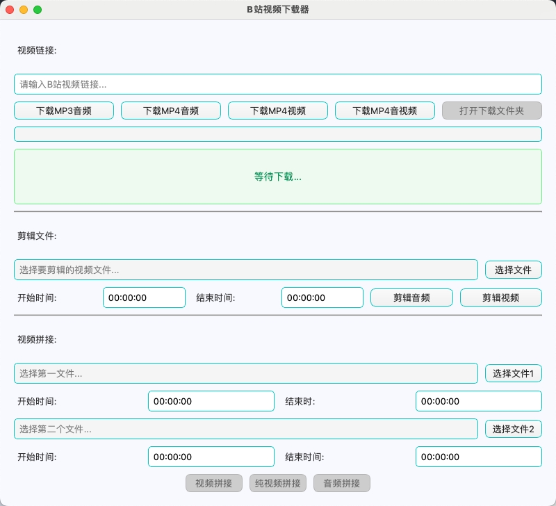

# B站视频下载与剪辑工具

## 项目简介
这是一个基于 Python 开发的 B站视频下载与剪辑工具，提供了视频下载、音视频剪辑、音视频拼接等功能的图形界面应用程序。用户可以通过简单的操作完成 B站视频的下载和后期处理。

## 预览


## 技术栈
- Python 3.x
- PySide6 (Qt for Python) - GUI框架
- bilibili-api - B站API接口
- moviepy - 视频处理
- requests - HTTP请求
- asyncio - 异步IO

## 文件结构
```
B站视频下载与剪辑工具/
├── main.py         # 主程序文件
├── style.qss      # 界面样式表
└── README.md      # 项目文档
```

## 编码规范
- 遵循 PEP 8 Python编码规范
- 使用类型提示增强代码可读性
- 函数和方法都有详细的文档字符串
- 异常处理完善，确保程序稳定性
- 资源管理严格，确保正确释放

## 实现功能

### 1. 视频下载
- 支持通过BV号下载B站视频
- 提供多种下载选项:
  - MP3音频
  - MP4音频
  - MP4视频(无音频)
  - MP4完整视频(音视频)
- 显示下载进度
- 支持打开下载文件夹

### 2. 音视频剪辑
- 支持剪辑MP3和MP4文件
- 提供音频剪辑功能:
  - MP3文件剪辑
  - MP4音频提取和剪辑
- 提供视频剪辑功能:
  - 纯视频剪辑
  - 音视频剪辑
- 可设置起止时间

### 3. 音视频拼接
- 支持两个文件的拼接
- 提供多种拼接模式:
  - 音频拼接(MP3/MP4)
  - 视频拼接
  - 纯视频拼接
- 可分别设置两个文件的时间段

## 使用教程

### 视频下载
1. 复制B站视频链接或BV号到输入框
2. 选择下载类型(MP3/MP4音频/视频)
3. 点击对应的下载按钮
4. 等待下载完成
5. 可点击"打开下载文件夹"查看文件

### 音视频剪辑
1. 点击"选择文件"选择要剪辑的文件
2. 设置开始时间和结束时间
3. 选择剪辑音频或剪辑视频
4. 等待剪辑完成

### 音视频拼接
1. 选择第一个文件并设置时间段
2. 选择第二个文件并设置时间段
3. 选择拼接模式(音频/视频/纯视频)
4. 等待拼接完成

## 注意事项
1. 下载视频需要稳定的网络连接
2. 处理大文件时可能需要较长时间，请耐心等待
3. 剪辑和拼接操作无法撤销，请谨慎操作
4. 建议在操作前备份重要文件
5. 程序运行时请勿关闭主窗口
6. 确保系统有足够的存储空间
7. 如遇到错误提示，请查看状态栏信息
8. MP4文件可能同时包含视频流和音频流，请根据需要选择适当的处理方式
9. 在处理过程中禁用相关按钮以防止重复操作
10. 关闭程序时会等待当前任务完成

## 许可证
MIT License
